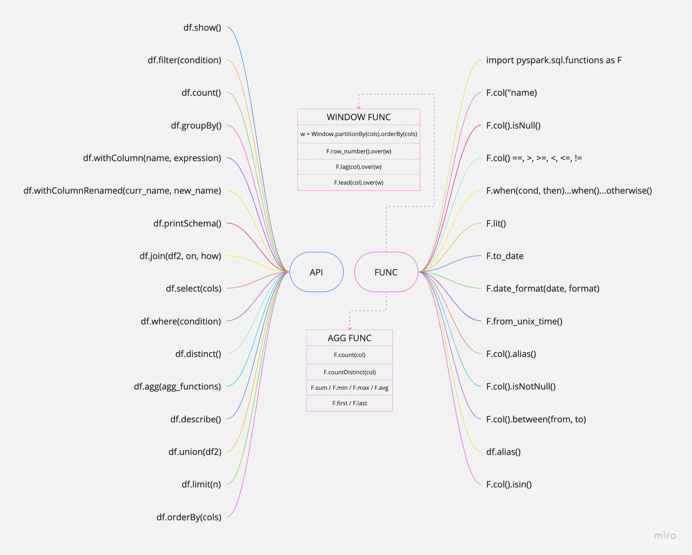

The readme.md file contains a description of how the run_the_spark_with_etl.ipynb file is structured. 

Contents of the run_the_spark_with_etl.ipynb file:
- First Stage. Connecting PySpark to the local machine on Jupyter. 
- Second stage. Setting up a rudimentary ETL-pipeline to make Spark visible. 
 
If you want to see the results of the ETL-process, look in the /results folder where the CSV file is. 

Also you can check my point of view for the PySpark most important API function list.

